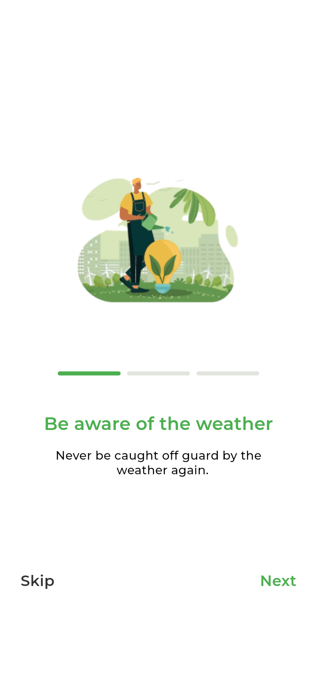
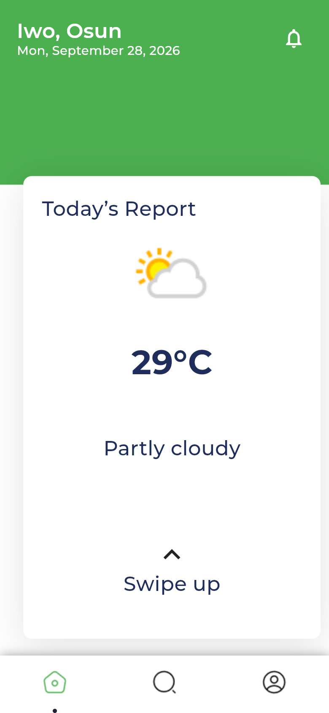
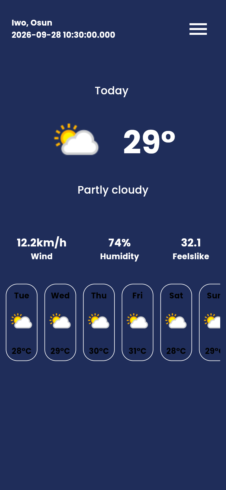
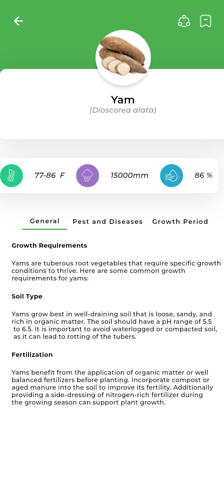

# AgroAlerts 🌱

**Hyper-local weather and crop guidance for farmers, built with Flutter.**

AgroAlerts detects the farmer's location, pulls a live forecast and presents it as a simple daily report, with a night-mode forecast view and crop-specific growing guidance.


## Screenshots

<table>
  <tr>
    <td align="center"><br/><sub>Splash</sub></td>
    <td align="center"><br/><sub>Onboarding</sub></td>
    <td align="center"><br/><sub>Sign up</sub></td>
  </tr>
  <tr>
    <td align="center"><br/><sub>Today's report</sub></td>
    <td align="center"><br/><sub>Night mode + weekly forecast</sub></td>
    <td align="center"><br/><sub>Crop guide (Yam)</sub></td>
  </tr>
</table>

## Features

- **Live local weather** from the [WeatherAPI.com](https://www.weatherapi.com/) forecast endpoint: current temperature, condition, feels-like, humidity and wind speed.
- **7-day forecast** cards. The view model also parses hourly data, UV, air quality (US EPA index), pressure and sunrise/sunset, ready for upcoming screens.
- **Location-aware**: uses `geolocator` with a runtime permission flow (`permission_handler`).
- **Offline-friendly**: the last weather, hourly and weekly data are cached in `SharedPreferences` and shown instantly on launch. A connectivity check skips network calls when the device is offline.
- **Day and night home screens**: a dark forecast screen designed for evening use.
- **Crop guide**: a detail screen for yam with tabs for general requirements (growth conditions, soil type, fertilisation), pests & diseases, and growth period.
- **Onboarding flow** (3 pages with page indicator), **sign-up / sign-in** and **profile** screens (soil type and crop type preferences).
- Persistent bottom navigation (Home · Search · Profile).

> **Status:** the weather features are wired to a real API. Authentication, search and profile are UI only for now (no backend).

## Tech stack

| Area | Packages |
| --- | --- |
| UI | Flutter Material, `google_fonts`, `flutter_screenutil` (responsive sizing), `smooth_page_indicator`, `persistent_bottom_nav_bar` |
| State management | `stacked` (MVVM, `BaseViewModel` + `ViewModelBuilder`) |
| Data & networking | `http`, `intl`, `shared_preferences` |
| Device | `geolocator`, `permission_handler`, `connectivity_plus` |

### Architecture

A single `BaseModel` view model (Stacked) owns all weather state. It loads cached data first, checks connectivity and location permission, fetches the forecast, maps it into `HourlyWeather` / `WeatherDay` models and calls `notifyListeners()`. Screens bind to it with `ViewModelBuilder.reactive`.

## Project structure

```
lib/
├── main.dart                 # App entry: splash → onboarding → sign up → sign in → home
├── config.dart               # Brand colours
├── models/
│   ├── basemodel.dart        # Weather view model, API calls, caching, data models
│   └── nighttime_viewmodel.dart
├── onboarding/               # 3-page onboarding
├── screens/
│   ├── home.dart             # Today's report
│   ├── homedarl.dart         # Night mode + weekly forecast
│   ├── moredetailsscreen.dart# Crop guide
│   ├── signin.dart, signupscreens/, splash.dart, updateprofile.dart
└── bottom_nav/               # Bottom navigation, search, profile
images/                       # Illustrations, icons and weather assets
```

## Getting started

```bash
git clone https://github.com/Mickool17/agro_alerts.git
cd agro_alerts
flutter pub get
flutter run            # Android / iOS device or emulator
flutter run -d chrome  # or run in the browser
```

Requires Flutter 3.x (Dart 3). The WeatherAPI key is set in `lib/models/basemodel.dart`. Replace it with your own key from weatherapi.com.

## Author

Built by [@Mickool17](https://github.com/Mickool17)
